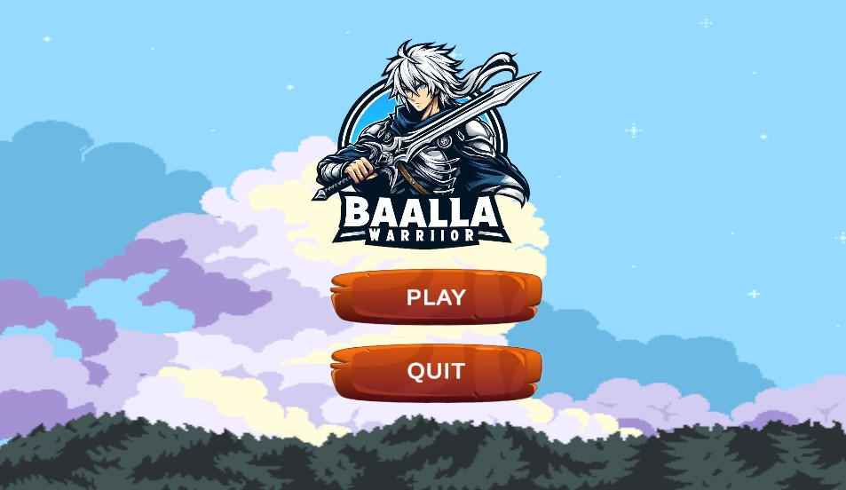
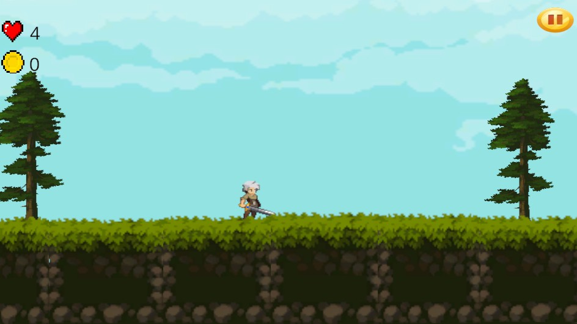
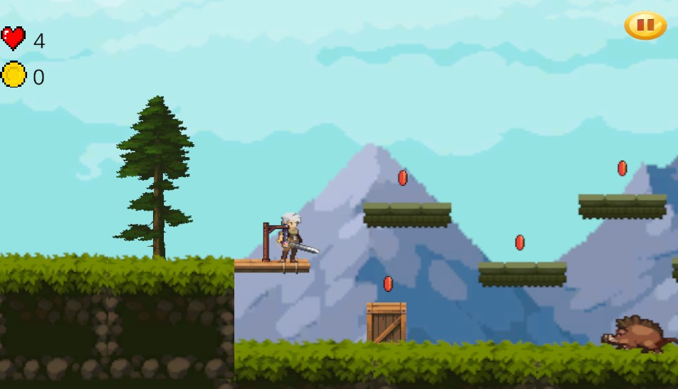
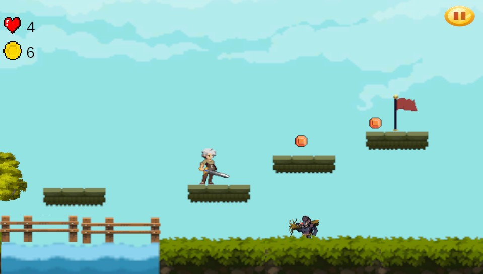

# ⚔️ Knight's Adventure: HeartCoin Quest

A dynamic 2D pixel-art platformer game built using **Unity 6** and **C#**. The player controls a heroic knight navigating through obstacles, collecting valuable HeartCoins, and dodging wild enemies like boars to reach the finish point.

### 🎮 Gameplay Preview

---

## 🎮 Key Gameplay Mechanics

* **2D Physics Movement:** Smooth horizontal movement and jumping physics using Unity's 2D Rigidbody system.
* **Global 2D Lighting:** Utilizes Unity 6's native Universal Render Pipeline (URP) 2D Global Light to create an immersive environment.
* **Collectible & Score System:** A trigger-based collision system that detects when the player collects a `HeartCoin`, calculating and updating the score UI.
* **Health & Hazard System:** Dynamic damage system where colliding with patrolling enemies (like the boar) decreases player health, leading to a Game Over or scene reset.
* **UI & State Management:** Features a fully functional Main Menu, Pause Menu, and Finish Point mechanism to transition between game states.

## 🛠️ Technical Architecture & Tech Stack

* **Game Engine:** Unity 6 LTS (Version: 6000.3.2f1)
* **Language:** C#
* **Graphics/Render Pipeline:** Universal Render Pipeline (URP) 2D

## 📂 Project Structure & Key Scripts

The architecture splits the game logic into dedicated, clean C# scripts located in `Assets/Scripts`:
* `PlayerMovement.cs` – Handles keyboard inputs, running velocity, and jumping states.
* `PlayerHealth.cs` – Manages the knight's health points, damage taken from hazards, and death triggers.
* `CoinCalculation.cs` – Tracks collected HeartCoins and updates the user interface.
* `Enemy1walk.cs` – Contains the AI patrolling movement logic for field enemies like the boar.
* `MainMenu.cs` & `Pausemenu.cs` – Manages user interface interaction, pausing time, and scene loading.

---

## 📸 In-Game Screenshots

| Editor & Environment View | Gameplay Scene |
|---|---|
|  |  |
|  |  |

---

## ⚙️ How to Setup and Run

1. **Clone or Download** this repository to your local computer.
2. Open **Unity Hub** and click **Add project from disk**.
3. Select this project folder. Make sure you have **Unity 6** installed.
4. Open the main menu scene located at `Assets/Scenes/GameMenu.unity`.
5. Press the **Play** button inside the editor to test the game!